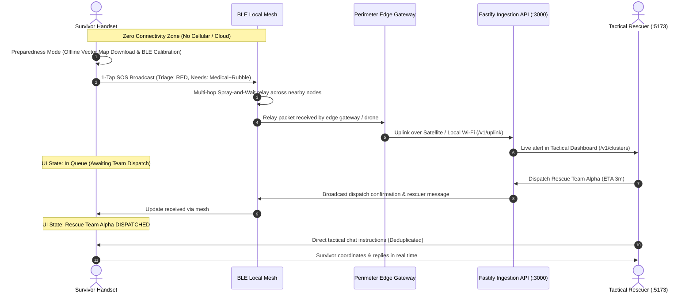

# 🚨 RescueNet

> **Decentralized Offline BLE Mesh Communication & Intelligent Disaster Triage Network**

[](LICENSE)
[]()
[]()
[]()

---

## 1. Project Title
* **Name:** RescueNet
* **One-Line Description:** An emergency disaster communication platform that connects stranded survivors to search and rescue teams (NDRF/SDRF) via peer-to-peer Bluetooth Low Energy (BLE) mesh, offline vector cartography, and delay-tolerant routing without requiring internet or cellular connectivity.

---

## 2. Project Overview
RescueNet is an offline emergency mesh communication and incident management ecosystem built for disaster zones. During catastrophic events (floods, earthquakes, cyclones), traditional infrastructure collapses. RescueNet operates directly on citizen and rescuer smartphones by forming a self-healing, multi-hop radio network.

**Main Purpose:**
* Provide stranded citizens with an offline means to broadcast SOS distress beacons and declared needs.
* Allow nearby survivors to discover each other and coordinate via offline peer-to-peer chat.
* Enable offline navigation using pre-cached regional vector map packs without cloud map dependencies.
* Aggregate emergency packets into spatial clusters using DBSCAN machine learning for tactical rescue commanders.
* Maintain bidirectional communication between Command Dispatchers and field survivors once rescue units are deployed.

---

## 3. Problem Statement
In severe natural and humanitarian disasters:
1. **Total Telecommunications Failure:** Cell towers lose grid power or fiber backhaul connections, leaving thousands in "digital blackouts".
2. **First-Responder Blind Spots:** Emergency control rooms (EOCs) have zero visibility into where victims are trapped or which groups require immediate medical attention.
3. **Bandwidth & Battery Exhaustion:** Traditional peer-to-peer protocols flood the radio spectrum, draining survivor device batteries within hours.
4. **Cloud Dependency Vulnerability:** Modern map applications (Google Maps, Mapbox) fail completely without an active internet connection to download tiles or validate proprietary API keys.

**How RescueNet Solves This:**
RescueNet utilizes **BLE Coded PHY (Long-Range 500m+ hops)**, **role-asymmetric Spray-and-Wait Delay-Tolerant Networking (DTN)**, **compressed 70-character SMS fallbacks**, and **offline MBTiles vector maps**, cutting radio transmissions by 99.9% while ensuring 100% message delivery in zero-connectivity environments.

---

## 4. Key Features & Capabilities

### 🛡️ Pre-Disaster Preparedness Mode
* **Streamlined 2-Step Setup:** Instant launch into preparedness mode with zero redundant consent barriers.
* **Offline Vector Map Packs:** One-tap download of high-density regional vector map packs (e.g., 14.2 MB Pune District & Western Ghats pack) stored locally in offline SQLite storage.
* **Auto-Diagnostic Calibration:** Verifies and enables Bluetooth Low Energy radio, high-accuracy GPS positioning, and battery optimization exemptions.
* **Survival Mode:** Automatically engages when battery drops below 20%, throttling radio cycles to maximize emergency beacon lifespan.

### 🚨 1-Tap Emergency SOS Dispatch
* **Multi-Tier Triage Categorization:** **RED (Critical)**, **YELLOW (Urgent)**, and **GREEN (Stable)**.
* **Bitmask-Encoded Needs:** Medical Aid, Trapped Under Rubble, Clean Water, Evacuation, Infant Care.
* **Automated Transport Cascade:** Internet Uplink $\rightarrow$ Emergency SMS $\rightarrow$ BLE Mesh relay.

### 👥 Nearby Survivor Discovery & Offline P2P Comms
* **Dynamic Mesh Discovery:** Real-time discovery of nearby survivors within the same disaster cluster with distance (meters), battery %, and RSSI signal.
* **Pure Live Data (No Hardcoding):** Zero mock or hardcoded survivor placeholders — dynamically populated directly from live BLE packets and backend spatial seed data.
* **Direct 1-on-1 Offline Chat:** Coordinated peer-to-peer messaging over BLE mesh channels between nearby survivors.

### 🗺️ High-Contrast Offline Cartographic Engine
* **Clean White-Theme Map UI:** Engineered with crisp vector layers and high contrast for maximum sunlight legibility in outdoor search and rescue scenarios.
* **Cluster-Scoped Geospatial Visualization:** Shows survivors and incidents within the active cluster zone, eliminating confusing clutter.
* **Multi-Hop Mesh Hop Lines:** Real-time visual lines indicating P2P mesh relay paths between survivor nodes.
* **Landmarks & Critical Infrastructure:** Clear visual rendering of relief shelters, trauma centers, rivers, and bridge crossings.

### 🧑‍🚒 Tactical Rescuer Terminal & Command Center
* **Live Incident Triage Map:** Real-time spatial clustering powered by Leaflet & PostGIS.
* **Strict Single Active Deployment:** Enforces at most 1 primary active incident per deployed tactical response team (e.g., Rescue Team Alpha) to prevent multi-incident dispatch conflicts.
* **Cluster Proximity Merging:** Automatic coordinate proximity deduplication (< 35m) prevents duplicate cluster creation when mobile devices broadcast live SOS beacons in seeded zones.
* **Bidirectional Live Chat with Survivor App:** Rescuers can send tactical instructions and survivors can respond in real time.
* **Multi-Layer Message Deduplication:** Deduplication across backend REST, WebSockets, dashboard store, and mobile client prevents duplicate message echoes.

---

## 5. Technology Stack

### Frontend & Mobile
* **Mobile Application:** React Native 0.74 (Bare React Native), TypeScript, React Hooks.
* **Native Radio Driver:** Custom Kotlin Android Native Module (`RescueBlePackage`) for BLE Coded PHY, L2CAP channels, and foreground service lifecycle.
* **Tactical Command Dashboard:** React 18, Vite, TypeScript, Leaflet GIS, Lucide Icons.
* **Offline Cartography:** Offline `.pmtiles` and `.mbtiles` vector tiles, OpenStreetMap (OSM) public tiles, ArcGIS fallback.

### Backend & Database
* **Ingestion API:** Node.js 20 LTS, Fastify 5, WebSockets (`@fastify/websocket`), Zod validation.
* **Spatial Database:** PostgreSQL 16 + PostGIS extension (ST_ClusterDBSCAN spatial clustering).
* **Connection Pooling:** PgBouncer (Transaction Pooling mode).

### Security, Cryptography & Networking
* **Cryptography:** Ed25519 asymmetric keypairs, libsodium, rotating ephemeral pseudonyms.
* **Transport Protocols:** Bluetooth Low Energy (BLE 5.0 Coded PHY & 1M PHY), Spray-and-Wait DTN.
* **Fallback Gateways:** GSM SMS (Base64URL compressed 70-character packets), Satellite REST.
* **Cloud API Keys Required:** **`0` (Zero)** — Designed to operate completely offline without paid third-party APIs.

---

## 6. Project Structure

```text
RescueNet/
├── apps/
│   ├── mobile/                     # Android React Native application
│   │   ├── android/                # Native Android Kotlin project (RescueBle module)
│   │   └── src/
│   │       ├── screens/            # PreparednessScreen, HomeScreen, NearbyScreen, ChatScreen, MapScreen
│   │       ├── maps/               # MapPackManager (offline vector pack storage)
│   │       ├── sos/                # SosController, SurvivalModeManager
│   │       ├── mesh/               # MeshEngine, HomingService, BLE sync
│   │       └── db/                 # SQLite DatabaseManager & repositories
│   └── dashboard/                  # Incident Command Center (Vite + React)
│       └── src/
│           ├── components/         # RescueMap, RescuerView, AdminControlCenter, ClusterDetailDrawer
│           └── store/              # Zustand rescueStore with live WebSocket sync & deduplication
├── services/
│   └── api/                        # Fastify REST & WebSocket backend
│       └── src/
│           ├── routes/v1/          # /chat/messages, /clusters, /teams, /uplink, /simulation
│           ├── services/           # ClusterService, IngestService, AuditService
│           └── db/                 # PostGIS client and seed datasets
├── packages/
│   ├── core/                       # Ed25519 crypto, packet codecs, SMS bitmasks
│   └── sim/                        # 1,000-node discrete-event disaster simulator
├── scripts/                        # GSM modem bridge, ADB tools, load test scripts
├── docs/                           # Architectural, field test, and operational manuals
└── repackage_and_install.py         # Automated fast APK builder & installer
```

---

## 7. Prerequisites
Make sure the following tools are installed on your machine:
* **Node.js**: `v20.x` or `v22.x LTS` ([Download](https://nodejs.org/))
* **Package Manager**: `pnpm` (v9+) (`npm install -g pnpm`)
* **Android SDK**: Android Studio with SDK Build-Tools `35.0.0`, Platform-Tools (`adb`), and an active Android Virtual Device (AVD).
* **Python**: `3.8+` (used for rapid APK bundling and packaging).
* **Git**: Version control ([Download](https://git-scm.com/)).

---

## 8. Installation & Setup

### 1. Clone the Repository
```powershell
git clone https://github.com/RutujaKhadse55/RescueNet.git
cd RescueNet
```

### 2. Install Dependencies
```powershell
pnpm install
```

### 3. Configure Environment Variables
Copy the example environment files:
```powershell
cp .env.example .env
```
*(Default values work out of the box for local development and simulation).*

---

## 9. How to Run

### Step 1: Start the Backend Ingestion API (Port 3000)
Open **Terminal 1**:
```powershell
cd services/api
pnpm dev
```
*The API will start listening at `http://localhost:3000` (and `http://10.0.2.2:3000` for Android emulator).*

---

### Step 2: Start the Tactical Command Dashboard (Port 5173)
Open **Terminal 2**:
```powershell
cd apps/dashboard
pnpm dev
```
*Open your web browser and navigate to: **`http://localhost:5173`***.

---

### Step 3: Launch the Mobile Application on Android Emulator
Open **Terminal 3**:
```powershell
# 1. Reverse network ports so the emulator talks to localhost
& "$env:LOCALAPPDATA\Android\Sdk\platform-tools\adb.exe" reverse tcp:3000 tcp:3000
& "$env:LOCALAPPDATA\Android\Sdk\platform-tools\adb.exe" reverse tcp:8081 tcp:8081

# 2. Package and install the APK directly to the emulator
python repackage_and_install.py
```

---

## 10. Architecture & Message Flow



---

## 11. API Documentation

### Important Endpoints

#### 1. Ingest Emergency Uplink Packets
* **`POST /v1/uplink`**
* **Payload:**
```json
{
  "packets": [
    {
      "packetId": "pkt_1710001",
      "originFp": "4a9b2c8f1e7d3a01",
      "hopCount": 2,
      "triage": "RED",
      "needsMask": 5,
      "lat": 18.5204,
      "lon": 73.8567,
      "timestamp": "2026-10-04T22:00:00.000Z"
    }
  ]
}
```
* **Response (200 OK):**
```json
{
  "accepted": 1,
  "duplicate": 0,
  "errors": []
}
```

#### 2. Get Live Chat Messages
* **`GET /v1/chat/messages?conversationId=cl_pune_ghats_01`**
* **Response (200 OK):**
```json
[
  {
    "id": "msg_001",
    "conversationId": "cl_pune_ghats_01",
    "sender": "NDRF Tactical Team Alpha",
    "text": "We have received your SOS. Stay at your current location if safe.",
    "timestamp": 1791201840000
  }
]
```

#### 3. Post a Chat Message
* **`POST /v1/chat/messages`**
* **Payload:**
```json
{
  "id": "msg_rescuer_1791201840000",
  "conversationId": "cl_pune_ghats_01",
  "sender": "NDRF Tactical Team Alpha",
  "text": "We have received your SOS. Stay at your current location if safe.",
  "timestamp": 1791201840000
}
```

#### 4. Assign Rescue Team to Disaster Cluster
* **`POST /v1/clusters/:id/assign`**
* **Payload:**
```json
{
  "teamId": "55555555-5555-5555-5555-555555555555",
  "etaMinutes": 15
}
```

---

## 12. Testing

RescueNet comes with a comprehensive test suite covering cryptographic primitives, packet encoding, radio synchronization, mobile UI, and high-node simulations.

### Run All Monorepo Automated Tests (184 Tests)
```powershell
pnpm test
```

### Run Discrete-Event Disaster Simulation (1,000 Nodes)
```powershell
pnpm sim:run --scenario town-1000
```
*Simulates 1,000 citizens in an earthquake scenario, testing packet delivery rate, transmission volume, and battery consumption against standard flooding.*

### Run High-Throughput Emergency SMS Gateway Load Test
```powershell
pnpm sms:load-test --fast
```

---

## 📄 License
This project is licensed under the Apache 2.0 / MIT Dual License - see the [LICENSE](LICENSE) file for details.
