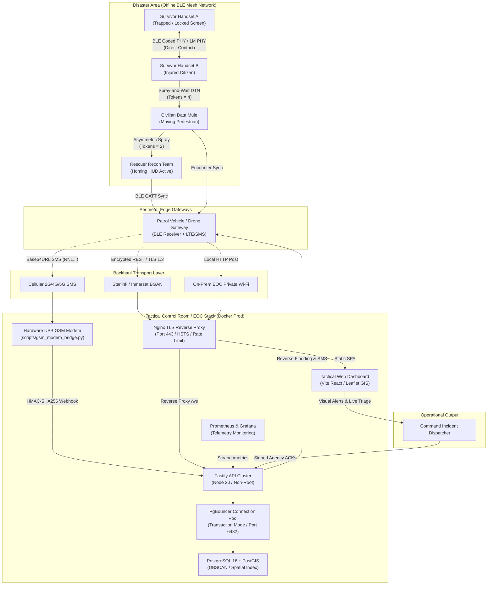
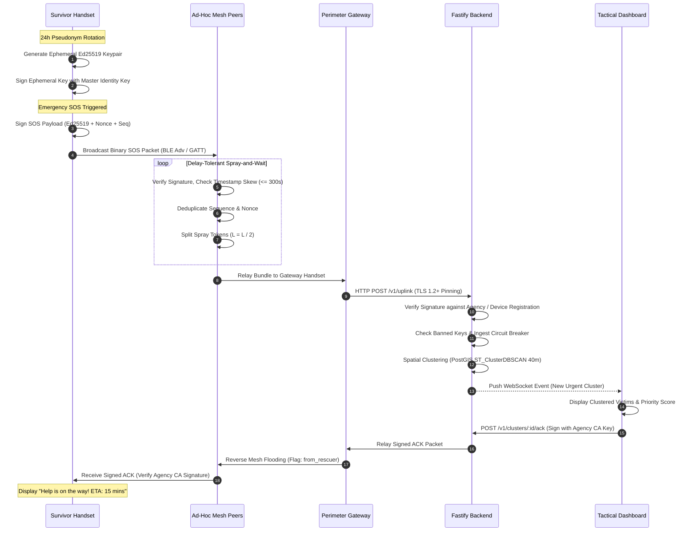

# RescueNet System Architecture & Data Flow Specification (Phase 16)

---

## 1. End-to-End System Architecture

```mermaid
graph TD
    subgraph "Disaster Area (Offline BLE Mesh Network)"
        VictimA["Survivor Handset A<br/>(Trapped / Locked Screen)"]
        VictimB["Survivor Handset B<br/>(Injured Citizen)"]
        Carrier["Civilian Data Mule<br/>(Moving Pedestrian)"]
        RescuerMobile["Rescuer Recon Team<br/>(Homing HUD Active)"]

        VictimA <-->|"BLE Coded PHY / 1M PHY<br/>(Direct Contact)"| VictimB
        VictimB -->|"Spray-and-Wait DTN<br/>(Tokens = 4)"| Carrier
        Carrier -->|"Asymmetric Spray<br/>(Tokens = 2)"| RescuerMobile
    end

    subgraph "Perimeter Edge Gateways"
        RoadGateway["Patrol Vehicle / Drone Gateway<br/>(BLE Receiver + LTE/SMS)"]
        RescuerMobile -->|"BLE GATT Sync"| RoadGateway
        Carrier -->|"Encounter Sync"| RoadGateway
    end

    subgraph "Backhaul Transport Layer"
        GSM_Tower["Cellular 2G/4G/5G SMS"]
        Sat_Link["Starlink / Inmarsat BGAN"]
        Local_LAN["On-Prem EOC Private Wi-Fi"]

        RoadGateway -.->|"Encrypted REST / TLS 1.3"| Sat_Link
        RoadGateway -.->|"Base64URL SMS (RN1...)"| GSM_Tower
        RoadGateway -.->|"Local HTTP Post"| Local_LAN
    end

    subgraph "Tactical Control Room / EOC Stack (Docker Prod)"
        NginxProxy["Nginx TLS Reverse Proxy<br/>(Port 443 / HSTS / Rate Limit)"]
        LocalModem["Hardware USB GSM Modem<br/>(scripts/gsm_modem_bridge.py)"]
        FastifyAPI["Fastify API Cluster<br/>(Node 20 / Non-Root)"]
        PgBouncer["PgBouncer Connection Pool<br/>(Transaction Mode / Port 6432)"]
        PostGIS["PostgreSQL 16 + PostGIS<br/>(DBSCAN / Spatial Index)"]
        TacticalDashboard["Tactical Web Dashboard<br/>(Vite React / Leaflet GIS)"]
        Prometheus["Prometheus & Grafana<br/>(Telemetry Monitoring)"]

        Sat_Link --> NginxProxy
        Local_LAN --> NginxProxy
        GSM_Tower --> LocalModem
        LocalModem -->|"HMAC-SHA256 Webhook"| FastifyAPI
        NginxProxy -->|"Reverse Proxy /ws"| FastifyAPI
        NginxProxy -->|"Static SPA"| TacticalDashboard
        FastifyAPI --> PgBouncer
        PgBouncer --> PostGIS
        Prometheus -->|"Scrape /metrics"| FastifyAPI
    end

    subgraph "Operational Output"
        TacticalDashboard -->|"Visual Alerts & Live Triage"| Dispatcher["Command Incident Dispatcher"]
        Dispatcher -->|"Signed Agency ACKs"| FastifyAPI
        FastifyAPI -->|"Reverse Flooding & SMS"| RoadGateway
    end
```

---

## 2. Cryptographic Security & Lifecycle Flow

```mermaid
sequenceDiagram
    autonumber
    participant Survivor as Survivor Handset
    participant Mesh as Ad-Hoc Mesh Peers
    participant Gateway as Perimeter Gateway
    participant API as Fastify Backend
    participant Dashboard as Tactical Dashboard

    Note over Survivor: 24h Pseudonym Rotation
    Survivor->>Survivor: Generate Ephemeral Ed25519 Keypair
    Survivor->>Survivor: Sign Ephemeral Key with Master Identity Key

    Note over Survivor: Emergency SOS Triggered
    Survivor->>Survivor: Sign SOS Payload (Ed25519 + Nonce + Seq)
    Survivor->>Mesh: Broadcast Binary SOS Packet (BLE Adv / GATT)
    
    loop Delay-Tolerant Spray-and-Wait
        Mesh->>Mesh: Verify Signature, Check Timestamp Skew (<= 300s)
        Mesh->>Mesh: Deduplicate Sequence & Nonce
        Mesh->>Mesh: Split Spray Tokens (L = L / 2)
    end

    Mesh->>Gateway: Relay Bundle to Gateway Handset
    Gateway->>API: HTTP POST /v1/uplink (TLS 1.2+ Pinning)
    
    API->>API: Verify Signature against Agency / Device Registration
    API->>API: Check Banned Keys & Ingest Circuit Breaker
    API->>API: Spatial Clustering (PostGIS ST_ClusterDBSCAN 40m)
    API-->>Dashboard: Push WebSocket Event (New Urgent Cluster)

    Dashboard->>Dashboard: Display Clustered Victims & Priority Score
    Dashboard->>API: POST /v1/clusters/:id/ack (Sign with Agency CA Key)
    API->>Gateway: Relay Signed ACK Packet
    Gateway->>Mesh: Reverse Mesh Flooding (Flag: from_rescuer)
    Mesh->>Survivor: Receive Signed ACK (Verify Agency CA Signature)
    Note over Survivor: Display "Help is on the way! ETA: 15 mins"
```
